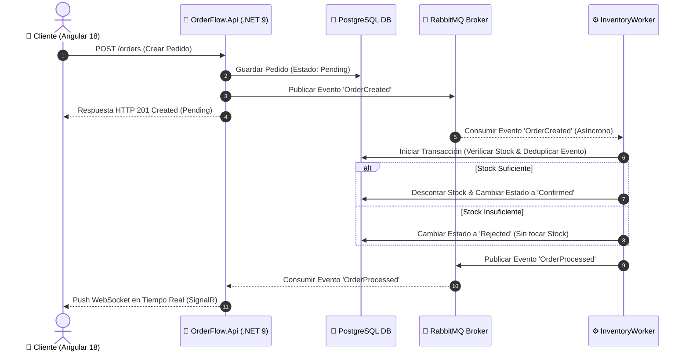

# 📦 OrderFlow - Sistema de Procesamiento de Pedidos e Inventario en Tiempo Real

OrderFlow es una solución backend y frontend empresarial de procesamiento de pedidos asíncrono y gestión de inventarios en tiempo real desarrollada con **.NET 9 (C# 13)**, **Angular 18**, **PostgreSQL 16**, **RabbitMQ**, **SignalR (WebSockets)** y **Docker**.

Implementa una arquitectura de **Monolito Modular Orientado a Eventos (EDA)** con límites estrictos entre capas (*Bounded Contexts*), garantizando resiliencia, alta disponibilidad e idempotencia.

---

## ⚡ Instrucciones de Despliegue (Quick Start < 10 min)

### 🔹 Opción A: Despliegue Automatizado con Docker Compose (Recomendado)

Cualquier evaluador puede compilar y levantar el ecosistema completo con **un único comando**:

```bash
docker compose up --build -d
```

Este comando descargará, compilará y ejecutará los 5 contenedores interconectados en la red `orderflow-net`:
- **Frontend Angular (Nginx):** `http://localhost:4200`
- **Web API .NET (REST + SignalR Hub):** `http://localhost:5167`
- **RabbitMQ Dashboard Web:** `http://localhost:15672` (Usuario: `guest` | Clave: `guest`)
- **PostgreSQL Database:** `localhost:5432`

---

### 🔹 Opción B: Ejecución Local en Modo Desarrollo (.NET CLI)

1. **Levantar Infraestructura (PostgreSQL + RabbitMQ):**
   ```bash
   docker compose up -d postgres rabbitmq
   ```
2. **Ejecutar la Web API:**
   ```bash
   dotnet run --project src/OrderFlow.Api
   ```
3. **Ejecutar el Worker de Inventario:**
   ```bash
   dotnet run --project src/OrderFlow.InventoryWorker
   ```
4. **Ejecutar el Frontend Angular:**
   ```bash
   cd src/OrderFlow.App
   npm install
   npm start
   ```

---

## 🏗️ Decisiones de Arquitectura (ADR)

### 1. Monolito Modular & Bounded Contexts
El sistema se organizó bajo el patrón de **Monolito Modular** dividiendo responsabilidades en *Bounded Contexts* explícitos:
- **`OrderFlow.Api` (Contexto de Pedidos):** Expone la interfaz HTTP REST y el Hub de SignalR. Recibe solicitudes, valida mediante **FluentValidation**, asigna el estado inicial `Pending` y publica eventos de integración.
- **`OrderFlow.InventoryWorker` (Contexto de Inventario):** Servicio Worker desacoplado que consume eventos asíncronos de RabbitMQ, procesa la reserva/rechazo de existencias e impacta la base de datos de manera aislada.
- **`OrderFlow.Infrastructure`:** Capa de persistencia común mediante **Entity Framework Core 9**, Fluent API y migraciones PostgreSQL.
- **`OrderFlow.Shared`:** Contratos de eventos de integración puros (`OrderCreatedIntegrationEvent`, `OrderProcessedIntegrationEvent`) sin dependencias de infraestructura.



### 2. Persistencia (Elección de PostgreSQL vs In-Memory)
- Se eligió **PostgreSQL 16 real** en lugar de bases de datos en memoria para garantizar consistencia ACID relacional, soporte estricto de transacciones concurrentes, soporte de migraciones automáticas (`EF Core Migrations`) y bloqueo optimista/pesimista de stock.
- Se sembró dinámicamente un catálogo inicial (`ABC-01`: 100 unidades, `XYZ-02`: 50 unidades, `LMN-03`: 10 unidades).

---

## 🛡️ Manejo de Fallos, Resiliencia e Idempotencia

### 1. Manejo de Fallos (Escenarios Críticos)
- **¿Qué pasa si `InventoryWorker` se cae?**
  Las órdenes entrantes se guardan exitosamente en estado `Pending` en PostgreSQL y los eventos quedan almacenados de forma persistente en la cola durable `order-created-queue` de RabbitMQ (`Persistent = true`). En cuanto el Worker vuelve a estar disponible, procesa las órdenes pendientes acumuladas sin pérdida de información.
- **¿Qué pasa si RabbitMQ no está disponible durante la publicación?**
  La API captura el fallo y devuelve un error RFC 7807 (`ProblemDetails`) con código 500 informando que la orden no pudo ser enviada a procesamiento.

### 2. Idempotencia en Mensajería (Inbox Pattern)
Para prevenir duplicaciones debido a re-entregas de RabbitMQ (*at-least-once delivery*):
1. Cada evento contiene un `EventId` (GUID único).
2. El Worker consulta la tabla `ProcessedEvents` antes de procesar el pedido.
3. El descuento de stock, el cambio de estado (`Confirmed` / `Rejected`) y el registro del `EventId` en `ProcessedEvents` se ejecutan dentro de una **Transacción Atómica Relacional** (`BeginTransactionAsync`).

---

## 🧪 Ejecución de Tests Automatizados

La suite incluye **7 pruebas unitarias completas** escritas con **xUnit**, **Moq** y **SQLite In-Memory** que prueban validadores, servicios y procesadores.

Para ejecutar todas las pruebas en verde con un solo comando:

```bash
dotnet test
```

Para ver el nivel de detalle paso a paso en consola:

```bash
dotnet test --logger "console;verbosity=detailed"
```

### Cobertura de Pruebas:
- **`CreateOrderRequestValidatorTests`**:
  - `Validar_CantidadFueraDeRango_DebeRetornarErrorDeValidacion` (Rechaza 0, negativos o >100 unidades).
  - `Validar_SkuInexistente_DebeRetornarErrorDeValidacion` (Rechaza SKUs no registrados).
- **`OrderServiceTests`**:
  - `CrearPedido_SolicitudValida_DebeGuardarPedidoPendienteYPublicarEvento` (Verifica guardado en `Pending` y llamadas a Moq de RabbitMQ).
- **`InventoryProcessorTests`**:
  - `ProcesarPedido_StockSuficiente_DebeConfirmarPedidoYDescontarStock` (Verifica estado `Confirmed` y descuento de stock).
  - `ProcesarPedido_StockInsuficiente_DebeRechazarPedidoSinDescontarStock` (Verifica estado `Rejected` e inventario intacto).

---

## ⚖️ Trade-offs Asumidos

1. **Monolito Modular con Base de Datos Compartida:**
   - *Decisión:* Ambas unidades lógicas (`Api` y `Worker`) comparten la misma base de datos física PostgreSQL a nivel de infraestructura para simplificar despliegues y reducir la sobrecarga de transacciones.
2. **Outbox Pattern en Memoria vs Outbox Tabla:**
   - *Decisión:* La publicación a RabbitMQ ocurre en línea durante la petición POST. En una arquitectura de producción masiva se usaría una tabla Outbox en PostgreSQL para evitar fallos si el broker cae en el milisegundo entre el guardado y la publicación.

---

## 🚀 Qué Haría Distinto con Más Tiempo

1. **Patrón Repositorio y Unidad de Trabajo (Repository & Unit of Work):**
   - Abstraer aún más la capa de persistencia de Entity Framework Core mediante interfaces de repositorio en `Domain`/`Application` para desacoplar completamente las consultas de la infraestructura.
2. **Mapeo Automatizado de Objetos (AutoMapper / Mapster):**
   - Implementar AutoMapper o Mapster para automatizar las conversiones entre Entidades de Dominio, DTOs de Petición y Respuestas HTTP, eliminando mapeos manuales repetitivos.
3. **Pipeline de Integración y Despliegue Continuo (CI/CD):**
   - Configurar flujos de trabajo automatizados en **GitHub Actions** o **GitLab CI** para compilar el proyecto, ejecutar `dotnet test` automáticamente en cada *Pull Request* y compilar/subir las imágenes Docker a un Registry (Docker Hub o AWS ECR).
4. **Implementación de Outbox Pattern Robusto:**
   - Integrar MassTransit o una tabla Outbox transaccional en PostgreSQL para garantizar la entrega de eventos al 100% incluso ante caídas repentinas de red durante el POST.
5. **Autenticación & Autorización Segura:**
   - Incorporar OAuth2 / OpenID Connect con **JWT (JSON Web Tokens)** para asegurar los endpoints REST y las conexiones WebSocket de SignalR.
6. **Pulido Visual y Mejoras de UX/UI en el Frontend (Angular):**
   - Incorporar notificaciones flotantes animadas (Toast alerts), paginación dinámica con filtros avanzados por estado (`Pending`, `Confirmed`, `Rejected`) en la tabla de pedidos y soporte para modo oscuro/claro.
