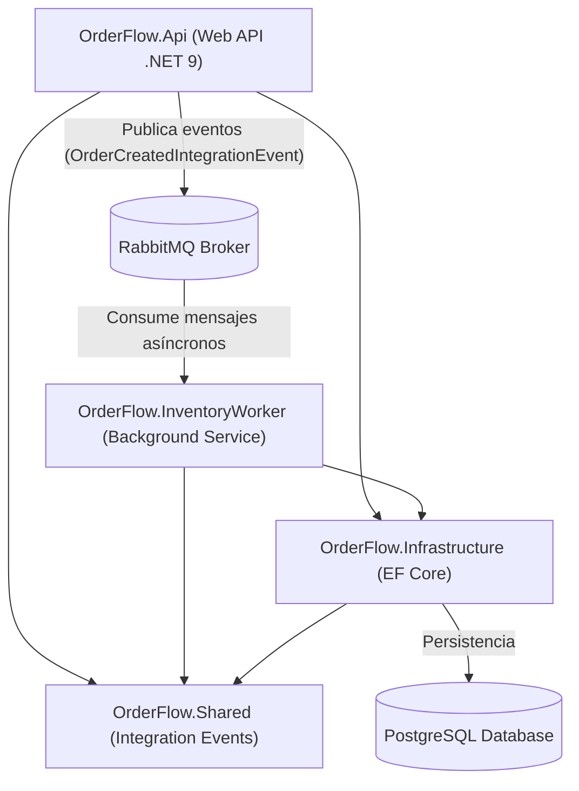

# 📦 OrderFlow - Sistema de Procesamiento de Pedidos e Inventario

OrderFlow es un sistema backend de procesamiento de pedidos asíncrono y gestión de inventario desarrollado con **.NET 9**, implementando una arquitectura de **Monolito Modular Orientado a Eventos (EDA)**, **PostgreSQL**, **RabbitMQ** y **Docker**.

---

## 🏗️ Arquitectura del Sistema

El proyecto está organizado en módulos desacoplados para mantener límites claros entre capas y responsabilidades:



---

## 🛠️ Tecnologías y Herramientas

* **Framework:** .NET 9 (C# 13)
* **Base de Datos:** PostgreSQL 16 (Entity Framework Core 9 con `Npgsql`)
* **Broker de Mensajería:** RabbitMQ 3 (Management Plugin)
* **Validación de Aplicación:** FluentValidation
* **Manejo de Errores:** RFC 7807 (`ProblemDetails` & `ValidationProblemDetails`)
* **Contenedores:** Docker & Docker Compose

---

## 📁 Estructura del Proyecto

* **`src/OrderFlow.Api`**: API RESTful encargada de la recepción de peticiones HTTP, validación con FluentValidation, almacenamiento inicial en estado `Pending` y publicación de eventos hacia RabbitMQ.
* **`src/OrderFlow.InventoryWorker`**: Worker Service en segundo plano que consume eventos de RabbitMQ de forma asíncrona, verifica la **idempotencia**, procesa transacciones atómicas y reserva/rechaza el stock disponible.
* **`src/OrderFlow.Infrastructure`**: Capa de persistencia con `OrderFlowDbContext`, Fluent API, migraciones y entidades de dominio (`Pedido`, `Stock`, `ProcessedEvent`, `OrderStatus`).
* **`src/OrderFlow.Shared`**: Eventos de integración compartidos entre los módulos (`OrderCreatedIntegrationEvent`).
* **`tests/OrderFlow.Tests`**: Proyecto de pruebas unitarias e integración.

---

## ⚙️ Requisitos Previos

* [.NET 9 SDK](https://dotnet.microsoft.com/download/dotnet/9.0)
* [Docker Desktop](https://www.docker.com/products/docker-desktop/)

---

## 🚀 Guía de Inicio Rápido

### 1. Iniciar los Servicios de Infraestructura (PostgreSQL y RabbitMQ)

En la raíz del proyecto, ejecuta:

```bash
docker compose up -d
```

Esto desplegará:
* **PostgreSQL:** `localhost:5432` (Base de datos: `orderflow_db`, Usuario: `orderflow_user`, Clave: `orderflow_password`)
* **RabbitMQ AMQP:** `localhost:5672`
* **RabbitMQ Dashboard Web:** `http://localhost:15672` (Usuario: `guest`, Clave: `guest`)

---

### 2. Ejecutar la Web API (`OrderFlow.Api`)

En una terminal en la raíz del proyecto:

```bash
dotnet run --project src/OrderFlow.Api
```

> **Nota:** La API aplicará automáticamente las migraciones pendientes de EF Core y creará las tablas junto con el catálogo de semillas inicial (`ABC-01`, `XYZ-02`, `LMN-03`).

---

### 3. Ejecutar el Worker de Inventario (`OrderFlow.InventoryWorker`)

En otra terminal en la raíz del proyecto:

```bash
dotnet run --project src/OrderFlow.InventoryWorker
```

El worker comenzará a escuchar eventos en la cola `order-created-queue` de RabbitMQ.

---

## 📌 Endpoints de la API

### 🔹 Crear Pedido (`POST /orders`)

**Body (`application/json`):**

```json
{
  "clienteNombre": "Juan Pérez",
  "sku": "ABC-01",
  "cantidad": 5
}
```

**Respuesta (`201 Created`):**

```json
{
  "id": "f0e8e8ea-ca5d-4d29-a6ea-0d03c2248a38",
  "clienteNombre": "Juan Pérez",
  "sku": "ABC-01",
  "cantidad": 5,
  "estado": "Pending",
  "creadoEn": "2026-07-29T01:50:00.000Z"
}
```

---

### 🔹 Obtener Todos los Pedidos (`GET /orders`)

**Respuesta (`200 OK`):** Lista de todos los pedidos ordenados por fecha descendente.

---

### 🔹 Obtener Pedido por ID (`GET /orders/{id}`)

**Respuesta (`200 OK` / `404 Not Found`):** Detalle de la orden solicitada.

---

## 🛡️ Idempotencia y Consistencia

* **Idempotencia:** El worker consulta la tabla `ProcessedEvents` por el `EventId` recibido. Si el evento ya fue procesado previamente, se omite para evitar duplicados o cobros dobles de inventario.
* **Transacciones Atómicas:** Se utiliza `BeginTransactionAsync()` para asegurar que la actualización del estado del pedido (`Confirmed` / `Rejected`), la deducción de inventario y el registro de la idempotencia ocurran dentro de una única transacción en PostgreSQL.
